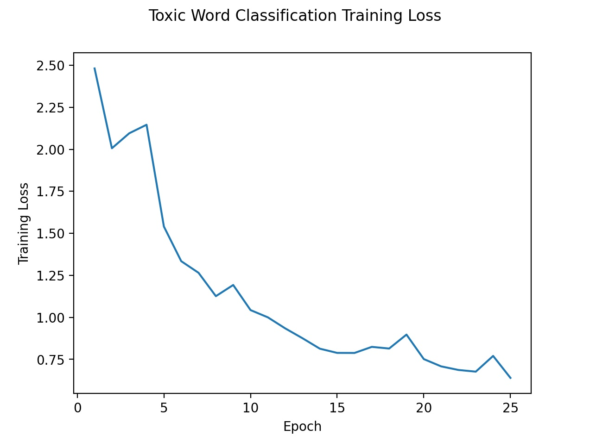

# Red Dragon AI Course Advanced NLP
This repository contains the assignment as a requirement to complete the Red Dragon AI Course on Advanced NLP. There are two components to this assignment - (i) the Toxic Word Challenge, and (ii) a NLP work of our own choice. For (ii), a chatbot is trained using the [Transformer](https://arxiv.org/abs/1706.03762) network using the [movie dialogue](http://www.cs.cornell.edu/~cristian/Cornell_Movie-Dialogs_Corpus.html) dataset. This repository covers the first assignment.

## Toxic Word Challenge Assignment
The first assignment is based on the [toxic word challenge](https://www.kaggle.com/c/jigsaw-toxic-comment-classification-challenge). This dataset is heavily imbalanced and could contain multiple labels per comment. Since this is a binary classification problem, a 1-Dimensional Convolution Layer across a window of 5 (`kernel_size = 5`) and a stride of 2, was applied for two times before passing the feature maps through 2 Fully-Connected layers to produce the logits. 

Taking a look at the data, there is a total of 6 classes corresponding to `toxic, severe_toxic, obscene, threat, insult, identity_hate`. A preview of a toxic and non-toxic comment is as shown below:

| id | comment_text | toxic | severe_toxic | obscene | threat | insult | identity_hate |
| -- | ------------ | ----- | ------------ | ------- | ------ | ------ | ------------- |
| 0000997932d777bf | Explanation\nWhy the edits made under my username Hardcore Metallica Fan were reverted? They weren't vandalisms... | 0 | 0 | 0 | 0 | 0 | 0 |
| 85b332fe1dcac880 | YOU ARE A PIECE OF F\*CKING SH\*T! \n\nf\*ck you! i like to change wikipedia so back off... poophead | 1 | 0 | 1 | 0 | 1 | 0 |

To get an idea of how imbalanced the dataset is, we can compute the fraction of labels which are positive.
```
import numpy as np
import pandas as pd
tmp_path = "C:/Users/admin/Desktop/Red Dragon/Advanced NLP/"

train_data = pd.read_csv(tmp_path + "toxic_words/train.csv")
tmp_labels = train_data[["toxic", "severe_toxic", "obscene", "threat", "insult", "identity_hate"]]
frac_label = np.sum(tmp_labels.values) / (tmp_labels.shape[0] * tmp_labels.shape[1])
```
This returns a value of `0.0367` or only 3.65% of the labels are positive. In addition, we can also observe that the positive labels display a correlation with each other.
```
tmp_labels = train_data[["toxic", "severe_toxic", "obscene", "threat", "insult", "identity_hate"]]
tmp_labels = tmp_labels.values

corr_mat = np.zeros([6, 6])
for n in range(6):
    for m in range(6):
        if n == m:
            corr_mat[n, m] = 1.0
        else:
            corr_mat[n, m] = np.corrcoef(tmp_val[:, n], tmp_val[:, m])[0, 1]
```
This yields the correlation matrix:
| label | toxic | severe_toxic | obscene | threat | insult | identity_hate |
| ----- | ----- | ------------ | ------- | ------ | ------ | ------------- |
| toxic | 1.0 | 0.3086191 | 0.67651452 | 0.15705841 | 0.64751813 | 0.26600938 |
| severe_toxic | 0.3086191 | 1.0 | 0.40301446 | 0.12360129 | 0.37580715 | 0.20160021 |
|obscene | 0.67651452 | 0.40301446 | 1.0 | 0.14117903 | 0.74127244 | 0.28686687 |
| threat | 0.15705841 | 0.12360129 | 0.14117903 | 1.0 | 0.15002241 | 0.11512833 |
| insult | 0.64751813 | 0.37580715 | 0.74127244 | 0.15002241 | 1.0 | 0.3377362 |
| identity_hate | 0.26600938 | 0.20160021 | 0.28686687 | 0.11512833 | 0.33773625 | 1.0 |

As the correlation matrix shows, some of the labels show a large degree of correlation between each other, for example, `toxic`, `obscene` and `insult` show a strong correlation ranging from 0.677 to 0.741. 

### Data Processing
Simple processing of the data was done, including lower-casing the comments, separating punctuation using `wordpunct_tokenize` from `nltk.tokenize` and building the vocabulary to consist of words which have occurred at least 10 times. Due to time constaints, sub-word encoding was not used. The maximum length of the comment was set to 250 tokens.
```
from collections import Counter
from nltk.tokenize import wordpunct_tokenize as word_tokenizer

w_counter = Counter()
tmp_comment = tmp_comment.replace("\n", " \n ")
tmp_tokens  = [
    x for x in word_tokenizer(tmp_comment.lower()) if x != ""]
w_counter.update(tmp_tokens)
```
The vocab is then built by
```
vocab_list = sorted(
    [x for x, y in w_counter.items() if y >= min_count])
```
where `min_count = 10`. In addition to that, in the test dataset, there are `-1` labels. These labels were assigned to a value of `0` when evaluating the model's performance on the test dataset, since it was empiracally observed that these comments were relatively neutral. Some examples include
```
\n\n == Sources == \n\n * Zawe Ashton on Lapland —  /  
```
and
```
:If you have a look back at the source, the information I updated was the correct form. I can only guess the source hadn't updated. I shall update the information once again but thank you for your message.
```
Nonetheless, it is worth noting that there were toxic comments that should clearly be given a label such as
```
Yo bitch Ja Rule is more succesful then you'll ever be whats up with you and hating you sad mofuckas...i should bitch slap ur pethedic white faces and get you to kiss my ass you guys sicken me. Ja rule is about pride in da music man. dont diss that shit on him. and nothin is wrong bein like tupac he was a brother too...fuckin white boys get things right next time.,
```
which, when set to have a label of 0, would not be an accurate depiction of the model's performance on the test dataset. In addition, we also note that there is potentially insufficient coverage between the test and training vocabularies, where approximately 20% of the tokens in the test vocabulary is not within the training vocabulary. This might affect the model's ability to predict the labels in the test dataset.

### 1-D Convolutional Neural Network Model
For the model, we introduced a bias `tf.math.log((1.0-tmp_pi)/tmp_pi)` to the logits to indicate the extent of imbalance in the labels, with `tmp_pi = 0.95`. This generally follows the advice given in the [Focal Loss](https://arxiv.org/abs/1708.02002) paper. The model as returned by `toxic_model.summary()` is as follows:
```
Model: "model"
_________________________________________________________________
Layer (type)                 Output Shape              Param #
=================================================================
x_input (InputLayer)         [(None, 251)]             0
_________________________________________________________________
embedding (Embedding)        (None, 251, 32)           672448
_________________________________________________________________
conv1d (Conv1D)              (None, 124, 64)           10304
_________________________________________________________________
tf_op_layer_Relu (TensorFlow [(None, 124, 64)]         0
_________________________________________________________________
conv1d_1 (Conv1D)            (None, 60, 128)           41088
_________________________________________________________________
tf_op_layer_Relu_1 (TensorFl [(None, 60, 128)]         0
_________________________________________________________________
flatten (Flatten)            (None, 7680)              0
_________________________________________________________________
linear1 (Dense)              (None, 128)               983168
_________________________________________________________________
linear2 (Dense)              (None, 32)                4128
_________________________________________________________________
logits (Dense)               (None, 6)                 198
_________________________________________________________________
tf_op_layer_add (TensorFlowO [(None, 6)]               0
=================================================================
Total params: 1,711,334
Trainable params: 1,711,334
Non-trainable params: 0
_________________________________________________________________
```
As can be observed, the model is relatively simple with about 1.7 million parameters. Where the comment exceeds the maximum length set, it is truncated. Otherwise, it is padded. The embedding dimension was set to 32 and a batch size of 256 was chosen for training, with the Adam optimizer being used to perform the weight updates.

### Model Losses
To handle the imbalanced labels, we could apply either the Focal Loss, or to weigh the sigmoid loss to allow a higher loss to be assigned to positive labels. In this assignment, I applied a weight to the binary loss as it showed better results. The training loss using a weight of 25.0 for positive labels yields a precision of 0.0962 and a recall of 0.8473, with an accuracy of approximately 93%. The training progress over 25 epochs is shown in Fig. 1 below.



Fig. 1: Training Loss of Toxic Word Model

The effect of varying the weights is shown in Table 1 below.
| Weight  | Precision | Recall |
| ------- | --------- | ------ |
|  1.0    | 0.1311    | 0.6797 |
| 10.0    | 0.1042    | 0.8132 |
| 25.0    | 0.0962    | 0.8473 |

Table 1: Precision and Recall Performance on test dataset using different weights for the positive labels

We can observe that increasing the weight of the positive labels generally leads to an increase in the recall but a decrease in the precision. This occurs because the higher weight leads to an increase in the True Positives while decreasing the False Negatives at the same time. However, a side effect of it is that the number of False Positives also increases. 

### Hyperparameter Tuning
Since the number of filters of our 1-D CNN model is, respectively, set to 2 and 4 times of the embedding dimension for the first and second convolutional layers. Hence, our hyper-parameter tuning focuses on changing the embedding dimension.

| Embedding Dimension | Number of Filters | Precision | Recall |
| ------------------- | ----------------- | --------- | ------ |
| 16 | 32, 64 | 0.1088 | 0.8321 |
| 32 | 64, 128 | 0.0962 | 0.8473 |
| 64 | 128, 256 | 0.1081 | 0.8176 |

Table 2: Hyper-parameter Tuning of the 1-D CNN Model

Simpler models appear to have a better recall, with an embedding dimension of 32 achieving the highest recall. 

### Conclusion
In this work, we trained a 1-D CNN to predict the toxicity of comments. Due to time constraints, we trained a relatively simple model and did not consider advanced methods like [BERT](https://arxiv.org/abs/1810.04805). To handle the imbalanced dataset, higher weights were assigned to the positive labels. We study the effects of weighing the sigmoid binary loss function was found to improve the recall at the expense of precision. Hyper-parameter tuning was applied, and we observe that simpler models seem to achieve a better recall.
