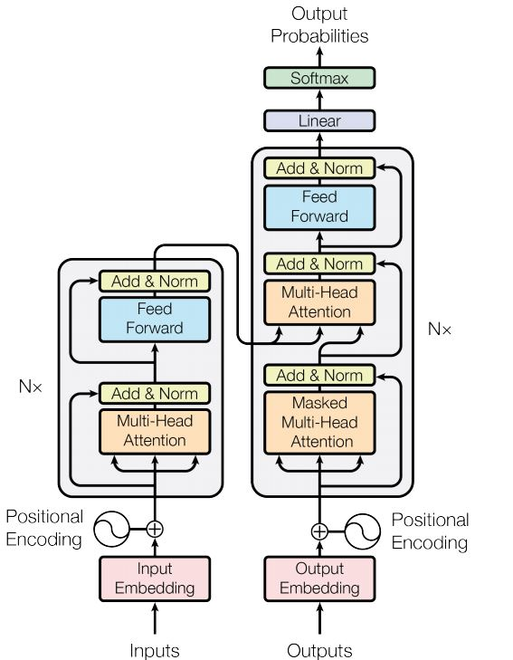
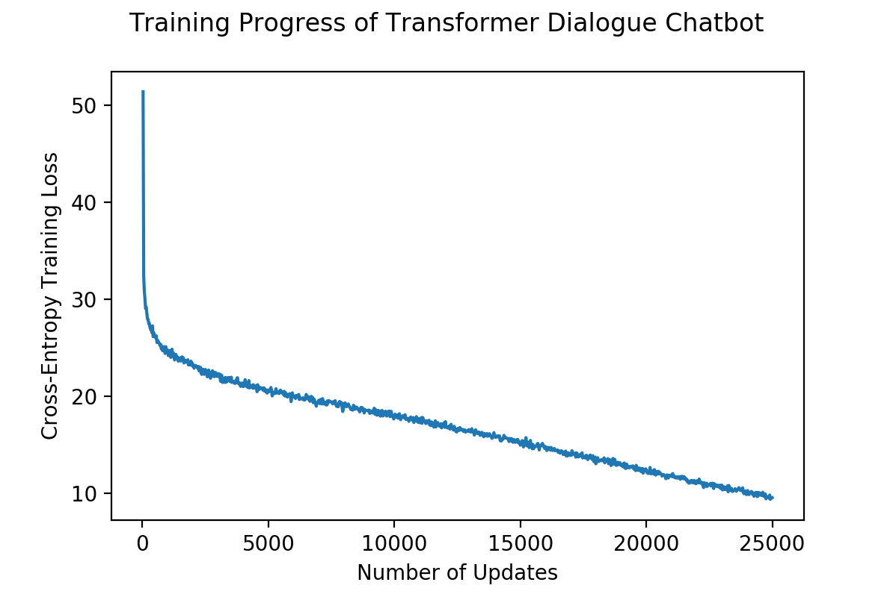

# Red-Dragon-AI-Course-Advanced-NLP-Assignment-2

## Movie Dialogue Chatbot
We now move on to the 2nd assignment, which is an NLP project of our choice. This assignment trains a movie dialogue chatbot using a [Transformer](https://arxiv.org/abs/1706.03762) network. The pre-processing of the data follow this [script](https://github.com/suriyadeepan/datasets/blob/master/seq2seq/cornell_movie_corpus/scripts/prepare_data.py) closely. The data can be obtained [here](http://www.cs.cornell.edu/~cristian/Cornell_Movie-Dialogs_Corpus.html).

### Data Pre-processing
Similar to our Toxic Word challenge assignment, we apply simple pre-processing for the data, including lower-casing, removing punctuation and applying word tokenisation to the text thereafter. Some examples of the processed data is shown below.
| Dialogue Input | Dialogue Output |
| -------------- | --------------- |
| gosh if only we could find kat a boyfriend | let me see what i can do |
| take it or leave it this isn t a negotiation | fifty and you ve got your man |
| are you ready to put him in | not yet |

We remark that in this assignment, only single turn conversation is considered. Hence, a multi-turn conversation which involves a few rounds of dialogue between the parties are not considered.

### Generating the Vocabulary
To generate the vocabulary, we replace certain symbols like `\\u`, `\\i`, as well as newlines `\n` and tabs `\t`. The regular expression `re.sub(r"[^\w\s]", " ", tmp_qns)` was used to remove punctuations from the text.
```
import re
from collections import Counter

w_counter = Counter()
tmp_tuple = []
for conv in convs:
    for i in range(len(conv)-1):
        tmp_qns = id2line[conv[i]].lower().replace(
            "\\u", " ").replace("\\i", " ").replace("\n", " ").replace("\t", " ")
        tmp_qns = re.sub(r"[^\w\s]", " ", tmp_qns)
        tmp_qns = [x for x in tmp_qns.split(" ") if x != ""]

        tmp_ans = id2line[conv[i+1]].lower().replace(
            "\\u", " ").replace("\\i", " ").replace("\n", " ").replace("\t", " ")
        tmp_ans = re.sub(r"[^\w\s]", " ", tmp_ans)
        tmp_ans = [x for x in tmp_ans.split(" ") if x != ""]

        if len(tmp_qns) == 0 or len(tmp_ans) == 0:
            continue
        elif len(tmp_qns) <= q_len and len(tmp_ans) <= a_len:
            w_counter.update(tmp_qns)
            w_counter.update(tmp_ans)
            tmp_tuple.append((" ".join(tmp_qns), " ".join(tmp_ans)))

vocab_size = 8000
vocab_list = sorted([x for x, y in w_counter.most_common(vocab_size)])
vocab_list = ["SOS", "EOS", "PAD", "UNK"] + vocab_list

idx2word = dict([
    (x, vocab_list[x]) for x in range(len(vocab_list))])
word2idx = dict([
    (vocab_list[x], x) for x in range(len(vocab_list))])
```
One peculiarity that might be observed in our pre-processing is that we used the same vocabulary for both the input and the output. This is because the dataset includes multi-turn conversations, where the output of the previous conversation could become the input of the next conversation. Hence, the vocabulary of the input and output responses have a high overlap, and we experiment training our Transformer Network using a single joint vocabulary to observe whether it is able to generalise its responses better. However, it is worth noting that while the vocabulary is shared between the input and the output responses, the encoder and decoder side do not share the same embeddings.

### Our Transformer Model
Our Transformer model makes some modifications to the original model, shown in Fig. 1, in that it trains a positional embedding layer at each layer of the encoder and decoder. In addition, it also adds a residual connection between the input embeddings at both the encoder and decoder, as well as applied layer normalisation before the residual connection. Apart from that, there were no further modifications made. 

The model uses 3 layers for both the encoder and decoder, an embedding dimension of 512, a hidden size of 256 and a feed-forward size of 1024. The sequence length at both the encoder and decoder was set to 10, which led to a total of approximately 94000 dialogue sequences, and a vocabulary of the most common 8000 words was used. A dropout probability of 0.1 was set to allow the model to generalise and the gradient was clipped at 1.0 during training. The loss function is the cross-entropy loss function and the Adam optimizer was used to perform the weight updates.



Fig. 1: Original Transformer Network in "Attention is All You Need" by Vaswani et al (2017)

Before sending the data into the Transformer model, the dialogue sequences need to be converted into their corresponding integer labels. This is done via
```
tmp_i_tok = data_tuple[tmp_index][0].split(" ")
tmp_o_tok = data_tuple[tmp_index][1].split(" ")

tmp_i_idx = [word2idx.get(x, UNK_token) for x in tmp_i_tok]
tmp_o_idx = [word2idx.get(x, UNK_token) for x in tmp_o_tok]
```
where `word2idx` is a dictionary mapping the word tokens into their corresponding integer labels. If the sequence is shorter than the encoder length, the remainder of the sequence is padded with the `PAD` token.

The model has approximately 57 million parameters as returned by `seq2seq_model.summary()` function. As our model is encapsulated in a custom class and applied without using the standard `tf.keras` functionalities, the summary of the model is unable to breakdown the number of parameters at each step.
```
Layer (type)                 Output Shape              Param #
=================================================================
Total params: 57,198,080
Trainable params: 57,198,080
Non-trainable params: 0
_________________________________________________________________
```
Due to limitations on the GPU card, we accumulate the gradients manually across sub-batches of 64, then average it to apply the overall weight update across a larger batch of 256 examples, since it is observed that larger batch sizes tend to stabilise the training of Transformer networks. 
```
with tf.GradientTape() as grad_tape:
    output_logits = model(tmp_encode, tmp_decode)
    
    tmp_losses = tf.reduce_sum(tf.reduce_sum(
        tf.nn.sparse_softmax_cross_entropy_with_logits(
            labels=tmp_output, logits=output_logits), axis=1))
    
    # Accumulate the gradients. #
    tot_losses += tmp_losses
    tmp_gradients = \
        grad_tape.gradient(tmp_losses, model_params)
    acc_gradients = [
        (acc_grad+grad) for \
        acc_grad, grad in zip(acc_gradients, tmp_gradients)]
```
Following the [T5 paper](https://arxiv.org/abs/1910.10683), 2000 warmup steps with a constant learning rate was applied `step_val = float(max(n_iter+1, warmup_steps))**(-0.5)`.

### Inference with the Transformer
While the Transformer model is able to train much faster than the Long-Short Term Memory (LSTM) networks due to the absence of recurrence during its training procedure, inference with the Transformer still incorporates recurrence. Our inference uses greedy decoding and is implemented via the `infer` function within the `TransformerNetwork` class.
```
def infer(self, x_encode, x_decode):
    # Encoder. #
    eps = 1.0e-6
    x_enc_token = tf.nn.embedding_lookup(self.W_enc_emb, x_encode)
    x_dec_token = tf.nn.embedding_lookup(self.W_dec_emb, x_decode)
    
    ...
    
    enc_outputs = transformer_encode(...)
    
    # Inference. #
    infer_embed = [tf.expand_dims(x_dec_token[:, 0, :], axis=1)]
    infer_index = []
    for step in range(self.seq_decode):
        ...
        
        tmp_outputs = transformer_decode(...)
        
        tmp_logit  = tf.matmul(
            tmp_outputs[:, -1, :], self.p_out_decode)
        tmp_argmax = tf.argmax(
            tmp_logit, axis=-1, output_type=tf.int32)
        next_embed = tf.matmul(
            tf.nn.softmax(tmp_logit), self.W_dec_emb)
        
        infer_index.append(tf.expand_dims(tmp_argmax, axis=1))
        infer_embed.append(tf.expand_dims(next_embed, axis=1))
        
    # Concatenate the list into a tensor. #
    infer_ids = tf.concat(infer_index, axis=1)
    return infer_ids
```
Nonetheless, we remark that our inference uses a softmax to obtain a weighted embedding representation of the next input via
```
next_embed = tf.matmul(tf.nn.softmax(tmp_logit), self.W_dec_emb).
```
This is to reduce the extent of error propagation caused by incorrect prediction of any label during the inference process.

### Training the Dialogue Transformer Network
As the training progressed, the quality of the response was observed to get better and better.
```
--------------------------------------------------
Iteration 250:
Elapsed Time: 0.913459050655365 mins.
Average Loss: 27.461065521240233
Gradient Clip: 1.0
Learning Rate: 0.0009882117

Input Phrase:
i didn t know which side you were on
Generated Phrase:
i EOS EOS EOS EOS EOS EOS EOS EOS EOS PAD
Actual Response:
now you know
--------------------------------------------------
Iteration 12000:
Elapsed Time: 0.8868237018585206 mins.
Average Loss: 16.775345306396485
Gradient Clip: 1.0
Learning Rate: 0.00040343576

Input Phrase:
it was open
Generated Phrase:
we was EOS PAD PAD PAD PAD PAD PAD PAD PAD
Actual Response:
you got a lotta nerve

Saved model to C:/Users/admin/Desktop/TF_Models/transformer_seq2seq\ckpt-480
--------------------------------------------------
Iteration 20000:
Elapsed Time: 0.90030277967453 mins.
Average Loss: 12.416839828491211
Gradient Clip: 1.0
Learning Rate: 0.0003125

Input Phrase:
it s about me and david
Generated Phrase:
what would PAD EOS EOS PAD PAD PAD PAD PAD PAD
Actual Response:
the perfect couple i should say

Saved model to C:/Users/admin/Desktop/TF_Models/transformer_seq2seq\ckpt-800
--------------------------------------------------
Iteration 25000:
Elapsed Time: 0.8974037408828736 mins.
Average Loss: 9.518194923400879
Gradient Clip: 1.0
Learning Rate: 0.0002795085

Input Phrase:
yeah but you you got a nice apartment
Generated Phrase:
well i don t EOS PAD PAD PAD PAD PAD PAD
Actual Response:
i have a tiny apartment

Saved model to C:/Users/admin/Desktop/TF_Models/transformer_seq2seq\ckpt-1000
--------------------------------------------------
```
The training progress is shown in Fig. 2.



Fig. 2: Training Progress of our modified Transformer Network on movie dialogue dataset

### Testing the Dialogue Transformer Network Chatbot
Having trained the chatbot, we can now try out some sample responses using the `movie_dialogue_test.py` script. While in an actual scenario, the replies after the `EOS` token should be disregarded, we display the entire response of the trained model.
```
--------------------------------------------------
Enter your phrase: when are you leaving

Input Phrase:
when are you leaving
Generated Phrase:
tomorrow EOS PAD PAD PAD PAD PAD PAD PAD PAD PAD
--------------------------------------------------
Enter your phrase: where do you come from

Input Phrase:
where do you come from
Generated Phrase:
california UNK EOS russian EOS PAD PAD PAD PAD PAD PAD
--------------------------------------------------
Enter your phrase: hey what s up

Input Phrase:
hey what s up
Generated Phrase:
what you doin okay EOS PAD PAD PAD PAD PAD PAD
--------------------------------------------------
Enter your phrase: how long has it been

Input Phrase:
how long has it been
Generated Phrase:
three years EOS day EOS PAD PAD PAD PAD PAD PAD
--------------------------------------------------
Enter your phrase: where are you going bob

Input Phrase:
where are you going bob
Generated Phrase:
to home EOS PAD PAD PAD PAD PAD PAD PAD PAD
--------------------------------------------------
Enter your phrase: goodbye

Input Phrase:
goodbye
Generated Phrase:
bye EOS PAD PAD PAD PAD PAD PAD PAD PAD PAD
--------------------------------------------------
```
As we can observe, the chatbot appears to generate relatively proper responses. In addition, the slang used in movie dialogues, for example _doin_ is reflected in its replies. It is also able to understand and reply when asked questions relating to time or place, as seen from its responses to `where do you come from`, `how long has it been` and `when are you leaving`. The model also demonstrated that it has learnt that no tokens should appear following the `EOS` token.

### Conclusion
In this assignment, we trained a dialogue chatbot using the movie dialogue dataset. Due to computation constraints, the encoder and decoder length were both set to 10, and the standard base Transformer network was used with some minor modifications. We experimented with the prospect of better generalisation using a joint vocabulary due to the high degree of overlap between the input and output responses of the dataset. The base Transformer model can also be observed to provide proper replies in general. Due to time constraints, hyper-parameter tuning was not performed.

### Appendix: Hardware
The model was trained using a Nvidia Quadro P1000 4GB Graphics Card.
